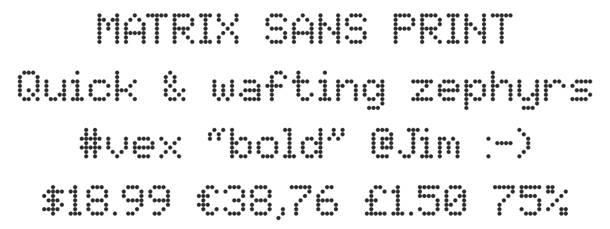
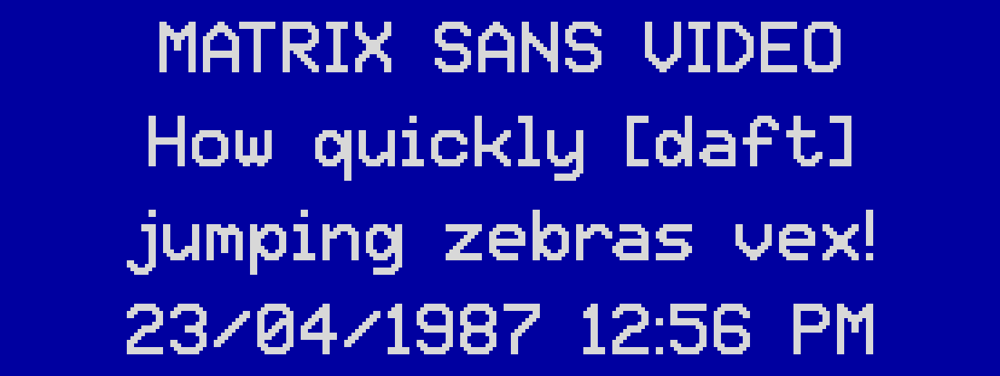
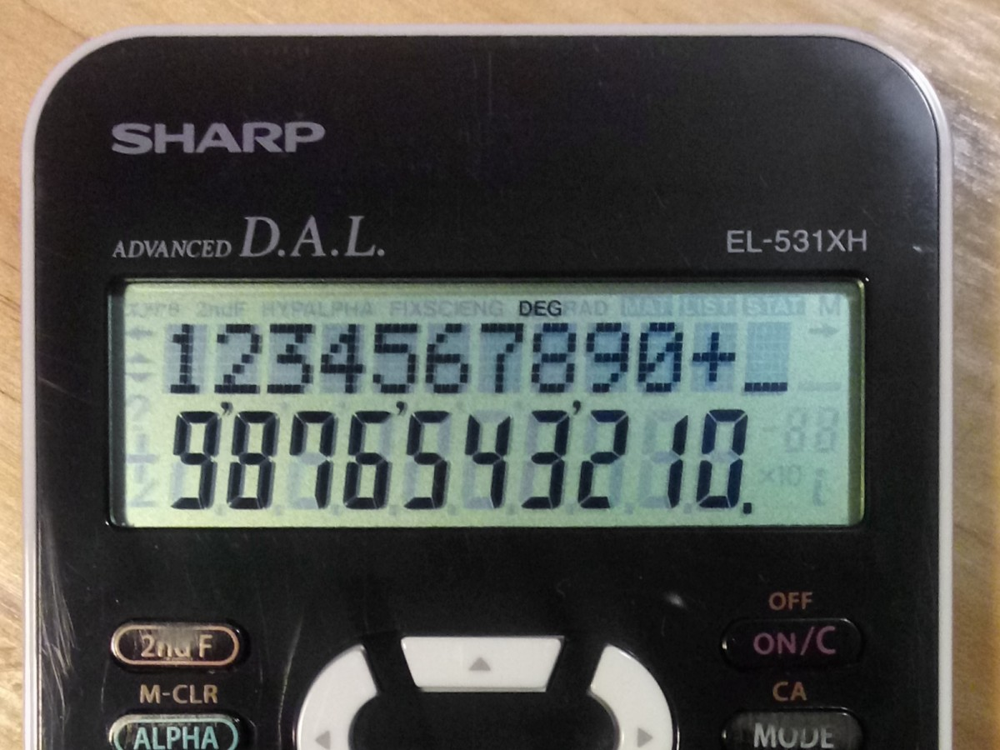
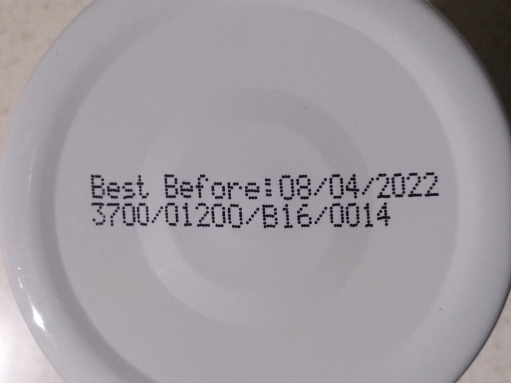
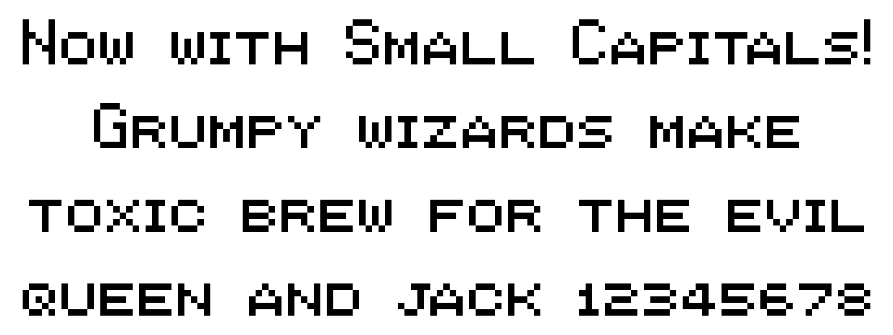

# Matrix Sans

This is set of pixelated, retro-style fonts based on the classic 5&times;7 dot matrix capitals. The design captures the look of this ubiquitous format, incorporating the best features from historical examples. There are five variants in this family:

- **Regular** is like most "pixel" fonts that use connected, square dots, like the displays of 8-bit home computers and video game consoles from the 1980s.
- **Print** is made up of separate circular dots, resembling the output of a dot-matrix printer or the expiry dates on food products. It also mimics the electronic signs found on motorways, at airports and train stations, etc.
- **Raster** consists of horizontal lines with rounded edges, emulating a *raster* &mdash; the set of lines traced out by the electron beam in a monochrome CRT.
- **Screen** is similar to Print, but uses square dots instead of round ones. It matches the look of the "character LCDs" seen in many devices, as well as some light-up LED displays.
- **Video** is an interpolated version of Regular. It resembles the on-screen displays of VCRs, Teletext, camcorders and the like; harking back to the early days of computerisation in television and home video.

## Background

For much of my life, I have liked both alphabets and lettering, and 8-bit home computers and video games. The intersection of those interests is low-resolution dot matrix graphics and fonts, which remain perhaps the most iconic feature of the 8-bit systems. Fonts based on a 5&times;7 dot matrix are especially noteworthy, having been some of the most common dimensions for over half a century.

In utilitarian applications, 5&times;7 dot matrix fonts may still be found all around us, for example: in calculators, microwave ovens, electronic road signs, train stations and airport terminals, dot-matrix printers (which have mostly fallen out of use, but the style is still commonly seen in the expiry dates printed on food packaging) and "character LCD" modules used in all manner of electronic devices:

|  |  |  |
| --- | --- | --- |
|  |  |  |

So-called "pixel" fonts are also a popular stylistic choice, often seen in contexts that have nothing to do with electronics or games, even in the absence of technical limitations. With all of that in mind, I felt that the typographical world could be enriched through the creation of high-quality, open-source fonts in this style.

### Research

Much of my interest in the topic was piqued by Damien Guard’s article, [*Typography in 8 bits: system fonts*](https://damieng.com/blog/2011/02/20/typography-in-8-bits-system-fonts). In preparation for this project, I decided to conduct an even more comprehensive study of classic dot-matrix fonts, with a focus on those using the iconic 5&times;7 dot matrix capitals.

See [documentation/research.md](documentation/research.md) for detailed documentation of this study and the decision-making process for the design of this font.

## Design philosophy

When designing the dot-matrix patterns for these fonts, I attempted to strike a balance between the following principles:

- authenticity
- quirkiness
- consistency
- sound design

*Authenticity* and *quirkiness* are often in conflict with *consistency* and *sound design*; the countless historical 5&times;7 fonts contain many unusual-looking (*quirky*) features, which by their nature are often inconsistent.

In order to retain the essence and charm of existing 5&times;7 fonts, yet rein in their oddities and avoid ugliness, none of these principles can be *fully* embraced. Instead, they serve as a guide while trying to choose the most coherent, well thought-out designs possible for this project.

### Proportional spacing

Readers today expect visually consistent spacing around all characters, including narrow ones like *1 I i l* and punctuation marks. Trading some *authenticity* for *sound design*, this font family is proportionally spaced, unlike most prior 5&times;7 fonts. The proportionally-spaced typefaces [American Typewriter](https://www.fonts.com/font/itc/itc-american-typewriter) and [OCR A Tribute](https://www.fonts.com/font/linotype/ocr-a-tribute) are similarly inspired by classic monospaced designs, but take the further step of tweaking the proportions of the glyphs themselves, in the pursuit of a more conventional reading experience. This design doesn't go that far: all glyphs (and spaces between them) are still based strictly on a square grid. Where possible, glyphs have been kept to no more than 5 dots wide, which would allow for a monospaced version to be created with mostly the same glyphs.

## Building

[![][Fontbakery]](https://FriedOrange.github.io/MatrixSans/fontbakery/fontbakery-report.html)
[![][Universal]](https://FriedOrange.github.io/MatrixSans/fontbakery/fontbakery-report.html)
[![][GF Profile]](https://FriedOrange.github.io/MatrixSans/fontbakery/fontbakery-report.html)
[![][Outline Correctness]](https://FriedOrange.github.io/MatrixSans/fontbakery/fontbakery-report.html)
[![][Shaping]](https://FriedOrange.github.io/MatrixSans/fontbakery/fontbakery-report.html)

[Fontbakery]: https://img.shields.io/endpoint?url=https%3A%2F%2Fraw.githubusercontent.com%2FFriedOrange%2FMatrixSans%2Fgh-pages%2Fbadges%2Foverall.json
[GF Profile]: https://img.shields.io/endpoint?url=https%3A%2F%2Fraw.githubusercontent.com%2FFriedOrange%2FMatrixSans%2Fgh-pages%2Fbadges%2FGoogleFonts.json
[Outline Correctness]: https://img.shields.io/endpoint?url=https%3A%2F%2Fraw.githubusercontent.com%2FFriedOrange%2FMatrixSans%2Fgh-pages%2Fbadges%2FOutlineCorrectnessChecks.json
[Shaping]: https://img.shields.io/endpoint?url=https%3A%2F%2Fraw.githubusercontent.com%2FFriedOrange%2FMatrixSans%2Fgh-pages%2Fbadges%2FShapingChecks.json
[Universal]: https://img.shields.io/endpoint?url=https%3A%2F%2Fraw.githubusercontent.com%2FFriedOrange%2FMatrixSans%2Fgh-pages%2Fbadges%2FUniversal.json

Fonts are built automatically by GitHub Actions - see the "Actions" tab for the latest build.

### Building manually

Ensure the following programs are installed: 
- [Python](https://www.python.org/downloads/), for running the following items
- [gftools](https://github.com/googlefonts/gftools), for building the fonts from the intermediate UFO sources
- [drawbot-skia](https://github.com/justvanrossum/drawbot-skia), for producing the sample images in the `documentation` folder (optional)
- [Font Bakery](https://github.com/googlefonts/fontbakery/), for testing the fonts (run `test.bat`) (optional)
- [sfdLib](https://github.com/MFEK/sfdLib.py), for generating the UFO sources (see below)

After installing Python (and ensuring it is added to the PATH environment variable), the others may be acquired automatically by running `pip install -r requirements.txt` at the command line.

To build the fonts on Windows:

- Run `build.bat` in the `sources` folder. 

To build the fonts on Linux or macOS:

- Run `make build` at the command line, in the `MatrixSans` folder.

### Modifying the fonts

The master source file, `MatrixSans_MASTER.sfd`, is in FontForge's SFD format. It is recommended to edit this file if you wish to modify the fonts. Then, re-generate the intermediate UFO sources by running `step2.bat`.

To easily add or modify glyphs (requires [FontForge](https://fontforge.org/), and its Python module to be accessible to your Python interpreter):

- Edit the image `glyphs.pbm`
- Set the corresponding glyph names in `glyphs.csv`
- Run `step1.bat` to generate a temporary font `temp.sfd` containing the new glyphs
- Using FontForge, copy the new glyphs into the master source file, `MatrixSans_MASTER.sfd`
- Run `step2.bat` and then `build.bat` to generate the intermediate UFO sources (and finished fonts) in the various styles
	- Custom behaviour is implemented for certain glyphs in the Video and Raster styles; edit `step2.py` to change this

## Changelog

#### 26 December 2022 - Version 1.100

- Added small capitals, accessible through the `smcp` and `c2sc` Opentype features
- Changed the design of Æ, æ, Œ, œ, Ð, đ, ħ, ƒ, and ₽ 
- Improved appearance of "M" in Video style
- Improved kerning

#### 19 December 2022 - Version 1.000
- Updated kerning
- Reduced space width
- Removed unnecessary space characters
- Updated strikeout width and position in Print, Raster and Screen styles
- Reduced dot size in Screen style

#### 14 December 2022 - Version 0.301
- Improved appearance of em dash, underscore, cedilla and ogonek in Raster style
- Added `meta` table to exported fonts, specifying designed/supported script
- Reduced number of contours in Regular style, by disabling Fontmake's overlap removal
- Removed ttfautohint from the build process
- Changed font names to meet Google Fonts requirements

#### 9 December 2022 - Version 0.300
- Added Raster style

#### 7 December 2022 - Version 0.216
- Improved kerning
- Changed appearance of alternative caron diacritic

#### 25 November 2022 - Version 0.215
- Improved Video style appearance
- Added additional whitespace and hyphen characters
- Fixed alignment of double acute accents
- Changed copyright and registered signs
- Updated font names
- Removed unreachable glyphs (which only existed to placate an older version of Font Bakery)
- Added Greek Delta and mu as references to existing glyphs
- Changed @ sign

#### 15 August 2022 - Version 0.214
- Added kerning

#### 5 August 2022 - Version 0.213
- Changed the working title from "Libre Dot Matrix" to "Matrix Sans"
- Improved the appearance of some characters in the Video style

#### August 2022 - Version 0.212
- Fixed accent placement on Ű and ű
- Increased line height
- Fixed underline position
- Added mark glyph class to the GDEF table to fix Font Bakery warning
- Fixed dot positioning in Screen style
- Increased height of dagger and double dagger

#### 31 July 2022 - Version 0.211
- Changed build process to work around several bugs in FontForge
- The Localised Forms (`locl`) OpenType feature now works correctly

#### 28 July 2022 - Version 0.210
- Modified Dutch ij ligature
- Modified capital letter Ŋ; added localised form for Northern Sami
- Added unencoded glyphs from Google Fonts Latin Core to avoid Font Bakery error (temporary)
- Added OpenType features: `ccmp`, `mark`, `locl`, `tnum`, `zero`

#### 25 July 2022 - Version 0.200
- Now supports [Google Fonts Latin Core](https://github.com/googlefonts/glyphsets/blob/main/GF_glyphsets/Latin/nam/GF_Latin_Core.nam) and [Adobe Latin 3](http://adobe-type-tools.github.io/adobe-latin-charsets/adobe-latin-3.html)
- Added dotted circle (U+25CC)
- Fixed soft hyphen
- Fixed WinAscent metric

#### 23 July 2022 - Version 0.100
- Now supports the [Adobe Latin 2](http://adobe-type-tools.github.io/adobe-latin-charsets/adobe-latin-2.html) character set
- Fixed character widths

#### 21 July 2022 - Version 0.002
- Improved Video style appearance
- Lengthened hyphen by one dot
- Fixed character widths
- Fixed line height
- Updated metadata: font names, PANOSE classification, etc.

#### 20 July 2022 - Version 0.001
- Initial test release
- Supports Basic Latin (ASCII)

## License

This Font Software is licensed under the SIL Open Font License, Version 1.1.
This license is available with a FAQ at
https://scripts.sil.org/OFL